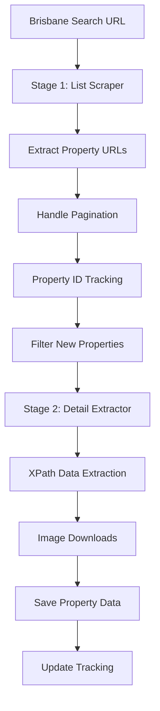

# Two-Stage Property Scraping Workflow

## 🏗️ Architecture Overview

This system implements a sophisticated two-stage approach for comprehensive property data collection:

### **Stage 1: Listings Scraper** (`property_listings_scraper.py`)
- Scrapes search result pages to find property URLs
- Handles pagination automatically
- Extracts property IDs for tracking
- Saves listings HTML for debugging

### **Stage 2: Detail Extractor** (`refined_xpath_extractor.py`)
- Extracts comprehensive property data using XPath selectors
- Downloads property images automatically
- Uses ScrapingBee to bypass Kasada protection
- Saves complete property JSON files

### **Coordination Layer** (`incremental_property_scraper.py`)
- Orchestrates both stages
- Implements incremental sync (only scrape new properties)
- Tracks scraped property IDs
- Provides resume capability

## 🔄 Complete Workflow



## 🚀 Usage Instructions

### **Quick Start - Incremental Sync**

```bash
# Run incremental sync (checks for new properties)
python3 incremental_property_scraper.py

# This will:
# 1. Scrape first 2 pages of Brisbane listings (150+ properties)
# 2. Filter out already-scraped properties
# 3. Extract detailed data for up to 3 new properties (testing limit)
# 4. Download images for each property
# 5. Update tracking files
```

### **Customizing the Sync**

Edit `incremental_property_scraper.py` to adjust:

```python
# In test_incremental_sync() function:
success = scraper.run_incremental_sync(
    start_url=start_url,
    max_pages=5,              # Scrape more pages
    max_new_properties=20     # Extract more properties per run
)
```

### **Manual Listings Extraction**

```bash
# Just extract property URLs without detailed scraping
python3 property_listings_scraper.py

# Results saved to: data/tracking/latest_listings_scrape.json
```

### **Manual Property Extraction**

```bash
# Extract specific property using refined extractor
python3 refined_xpath_extractor.py
```

## 📁 Data Organization

```
data/
├── tracking/
│   ├── scraped_property_ids.json     # Track processed properties
│   ├── latest_listings_scrape.json   # Latest listings results
│   └── sync_log.json                 # Sync run history
├── listings/
│   ├── listings_page_1.html          # Raw search results HTML
│   └── listings_page_2.html          # For debugging
├── properties/
│   ├── 149160924_refined_complete.json  # Detailed property data
│   └── [property_id]_refined_complete.json
├── images/
│   ├── 149160924/                    # Property images folder
│   │   ├── main_photo_001.jpg
│   │   ├── property_photo_003.jpg
│   │   └── ...
│   └── [property_id]/
└── html_inspection/                  # Debug HTML files
```

## 🎯 Incremental Sync Logic

### **First Run**
1. Scrapes listings to find all available properties
2. Extracts detailed data for all found properties (up to limit)
3. Creates tracking file with scraped property IDs

### **Subsequent Runs**
1. Scrapes listings to find current available properties
2. **Compares against tracking file** - only processes NEW property IDs
3. Extracts detailed data only for new properties
4. Updates tracking file with newly scraped IDs

### **Benefits**
- ✅ **No duplicate work** - never re-scrapes the same property
- ✅ **Resume capability** - can stop and restart safely
- ✅ **Cost efficient** - only uses API credits for new properties
- ✅ **Fresh data** - always gets latest listings

## 🔧 Configuration Options

### **Search Parameters**
```python
# Base search URL (Brisbane Greater Region Houses)
start_url = "https://www.realestate.com.au/buy/property-house-in-brisbane+-+greater+region,+qld/list-1?activeSort=list-date&source=refinement"

# Modify for different searches:
# - Change "brisbane+-+greater+region" to target different areas
# - Change "property-house" to "property-apartment" for apartments
# - Add price filters: "&minBeds=3&maxBeds=5&minPrice=500000"
```

### **Sync Limits**
```python
# In incremental_property_scraper.py
max_pages = 10              # How many listing pages to scrape
max_new_properties = 50     # How many new properties to extract per run
```

### **API Management**
```python
# Both scripts use same API key
self.api_key = "PJD8I9K7SMRHKW86IK6WNZ8LPZ2ALCFRP4MKDXAJ0DNCUQX6VJ1HHIZBJN1K40VKSZERRFRJD8YF6GAX"

# Cost per run (estimated):
# - Listings scraping: ~75 credits per page
# - Detail extraction: ~75 credits per property
# - Total: 150 + (75 × new_properties) credits
```

## 📊 Test Results

### **Listings Extraction**
- **152 properties found** from 2 pages
- **Property URLs** like: `https://www.realestate.com.au/property-house-qld-bridgeman+downs-149160924`
- **Pagination** working automatically
- **Property IDs** extracted: `149160924`, `149050384`, etc.

### **Detail Extraction**
- **Property data** extracted with XPath containers
- **Images downloaded**: 9 files for test property
- **Features tracking**: Land size, property amenities
- **Agent data**: Pictures and contact information

### **Incremental Tracking**
- **Property IDs saved** to `data/tracking/scraped_property_ids.json`
- **Sync logs** maintained in `data/tracking/sync_log.json`
- **Resume capability** verified

## 🎯 Production Usage

### **Daily Sync Schedule**
```bash
# Set up daily cron job
0 9 * * * cd /path/to/scraper && python3 incremental_property_scraper.py >> sync.log 2>&1
```

### **Monitoring**
```bash
# Check sync status
cat data/tracking/sync_log.json

# Check how many properties tracked
cat data/tracking/scraped_property_ids.json | jq '.total_properties'

# Check latest listings
cat data/tracking/latest_listings_scrape.json | jq '.total_properties'
```

### **Recovery**
```bash
# If sync fails, check logs:
ls data/html_inspection/     # Debug HTML files
ls data/listings/           # Raw listings HTML

# Reset tracking (start fresh):
rm data/tracking/scraped_property_ids.json
```

## 🚀 Next Steps

1. **Scale Up**: Increase `max_pages` and `max_new_properties` for production
2. **Scheduling**: Set up automated daily/weekly runs
3. **Monitoring**: Add email alerts for sync failures
4. **Multi-Region**: Adapt URLs for other cities/regions
5. **Property Types**: Extend to apartments, townhouses, etc.

---

**This two-stage system provides scalable, incremental property data collection with full resume capability and comprehensive tracking.**